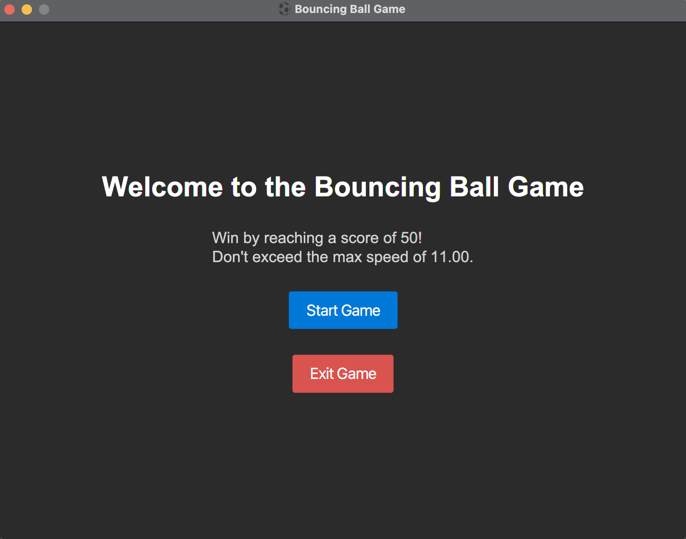
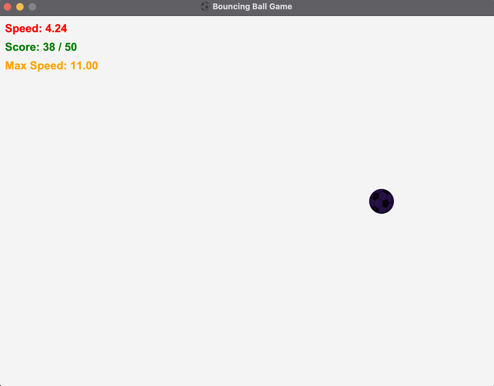
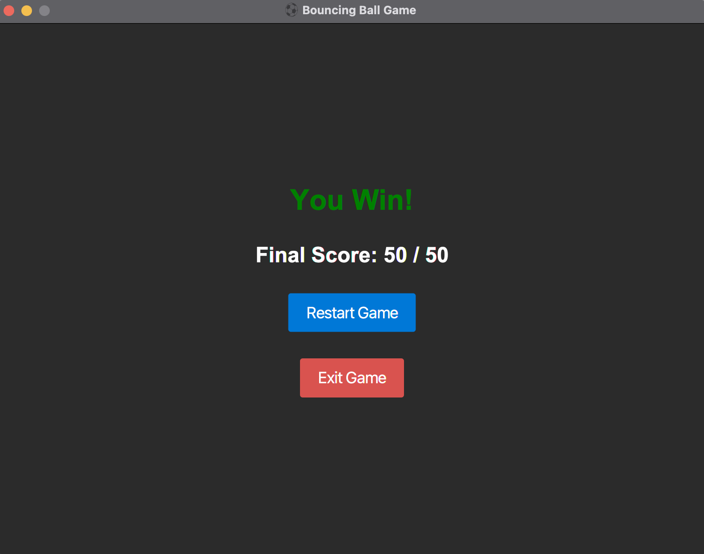
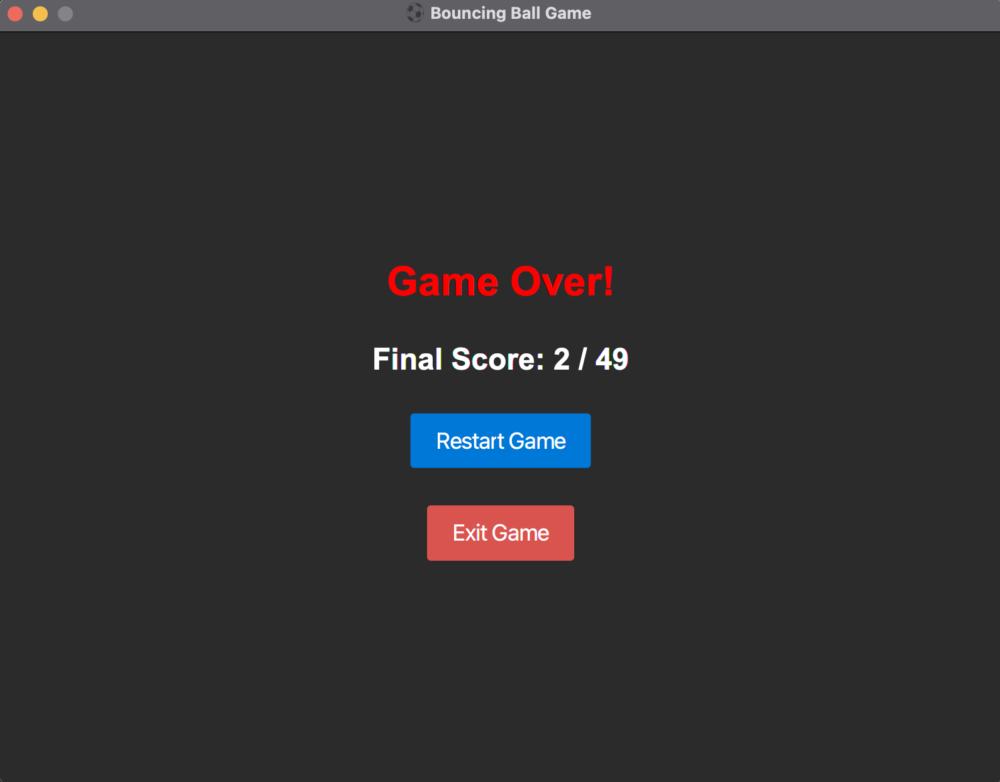

# Bouncing Ball Game with JavaFX

## Table of Contents

- [Overview](#overview)
- [How to Play](#how-to-play)
- [User Interface](#user-interface)
  - [Welcome Screen](#welcome-screen)
  - [Game Interface](#game-interface)
  - [Win Screen](#win-screen)
  - [Lose Screen](#lose-screen)
- [Features](#features)
- [Prerequisites](#prerequisites)
- [Setup and Installation](#setup-and-installation)
- [Configuration](#configuration)
- [Running the Application](#running-the-application)
- [Contributing](#contributing)
- [License](#license)
- [Author](#author)

## Overview

The Bouncing Ball game is a simple, interactive JavaFX application where a ball bounces around the screen. Users can control the speed of the ball using the up and down arrow keys. The game demonstrates the use of JavaFX animation and event handling capabilities.

## How to Play

1. **Start the Game**: Run the application to start the game. The ball will start bouncing around the screen.
2. **Objective**: Reach the number of bounces required to win the game without the ball going too fast.
3. **Control the Ball Speed**: Use the UP and DOWN arrow keys to increase or decrease the ball speed, respectively.
4. **Win or Lose**: If the ball reaches the required number of bounces without exceeding the maximum speed, you win. Otherwise, you lose.
5. **Play Again**: After winning or losing, you can play the game again by clicking the "Play Again" button.

## User Interface

### Welcome Screen

<p align="center" style="cursor: pointer">
    
</p>

### Game Interface

<p align="center" style="cursor: pointer">
    
</p>

### Win Screen

<p align="center" style="cursor: pointer">
    
</p>

### Lose Screen

<p align="center" style="cursor: pointer">
    
</p>

## Features

- Ball speed control with keyboard inputs (UP to increase speed, DOWN to decrease speed).
- Dynamic color change of the ball upon collision with the screen boundaries.
- Display of current ball speed on the screen.
- Game over screen with a win or lose message based on the ball speed.
- Different background colors for the game interface and game over screens.
- Customizable ball size, speed, and screen dimensions.
- And more!

## Prerequisites

- JDK 11 or above.
- Maven (for building the project).
- JavaFX SDK (compatible with your JDK version).
- A Java IDE (e.g. IntelliJ IDEA or Eclipse) is highly recommended.

## Setup and Installation

1. **Download JavaFX SDK**: Download the JavaFX SDK from the [OpenJFX](https://openjfx.io/) website and extract it to a known location on your machine.
2. **Clone the Repository**: Clone this repository to your local machine using `git clone <repository-url>`.

## Configuration

Before running the application, ensure that JavaFX is properly configured in your IDE (e.g., IntelliJ IDEA, Eclipse):
- **IntelliJ IDEA**:
  1. Go to `File` > `Project Structure` > `Libraries` and add the JavaFX SDK as a library to the project.
  2. In the `Run` configurations, add the VM options to include the JavaFX modules:
     ```
     --module-path "path/to/javafx-sdk/lib" --add-modules javafx.controls,javafx.fxml
     ```
     Replace `"path/to/javafx-sdk/lib"` with the actual path to the JavaFX SDK lib directory on your machine.

- **Eclipse**:
  1. Right-click on the project > `Properties` > `Java Build Path` > `Libraries` and add the JavaFX SDK as an external JAR.
  2. In the run configurations, add the VM arguments similar to the IntelliJ setup.

## Running the Application

To run the application, navigate to the `src/com/example/bouncingballgamejavafx` directory and compile the `BouncingBall.java` file. Then, execute the main method within the `BouncingBall` class.

Ensure that the JavaFX SDK is properly configured in your IDE before running the application.

Alternatively, you can run the application using the following Maven command:
```
mvn clean javafx:run
```

## Contributing

Contributions to the Bouncing Ball game are welcome. Please feel free to fork the repository, make your changes, and submit a pull request.

## License

This project is licensed under the MIT license. See [LICENSE](LICENSE) for more details.

## Author

- **Son Nguyen** - [hoangsonww](https://github.com/hoangsonww)

---

Created with ❤️ by [Son Nguyen](https://github.com/hoangsonww) in 2024.
